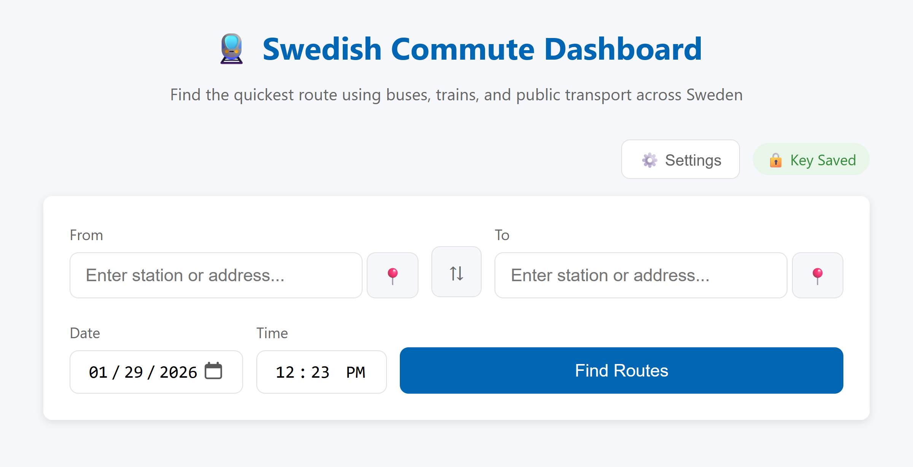

# 🚆 resrobot-bättre
En lättviktig webbdashboard för att hitta kollektivtrafikrutter i hela Sverige med bussar, tåg, spårvagnar och mer.



## Funktioner

- 🔍 **Sök platser**: Sök efter stationer och hållplatser i hela Sverige
- 📍 **Nuvarande plats**: Använd din GPS för att hitta närliggande hållplatser
- 🚆 **Multimodala rutter**: Få rutter med tåg, bussar, spårvagnar, tunnelbana och mer
- ⏰ **Avgångstid**: Planera resor för specifika datum och tider
- 🔑 **Säker API-nyckellagring**: Nyckeln är förvrängd och lagras lokalt i din webbläsare
- 📱 **Mobilanpassad**: Responsiv design fungerar på alla enheter
- ⚡ **Lättviktig**: Inga tunga ramverk, snabb laddning

## Datakälla

Denna app använder [ResRobot API](https://www.trafiklab.se/api/our-apis/resrobot-v21/route-planner/) från Trafiklab, som täcker alla kollektivtrafikoperatörer i Sverige.

## Snabbstart

### 1. Installera dependency

```bash
pip install -r requirements.txt
```

### 2. Kör appen

```bash
python app.py
```

### 3. Öppna i webbläsare

Navigera till: http://localhost:5000

### 4. Ange din API-nyckel

Vid första starten visas en dialogruta som ber om din Trafiklab API-nyckel:

1. Gå till [trafiklab.se](https://www.trafiklab.se/) och skapa ett gratis konto
2. Prenumerera på **ResRobot - v2.1** API (Bronze-nivån är gratis)
3. Kopiera din API-nyckel och klistra in den i dashboarden
4. Kryssa i "Kom ihåg denna nyckel" för att spara den säkert i din webbläsare

Din API-nyckel är **förvrängd** (inte klartext) och lagras i din webbläsares localStorage. Du kan ändra den när som helst genom att klicka på knappen **⚙️ Inställningar**.

## Användning

1. **Ange ursprung**: Skriv ett stationsnamn i fältet "Från" och välj från förslag
2. **Ange destination**: Skriv ett stationsnamn i fältet "Till"
3. **Ställ in tid** (valfritt): Justera datum och tid för din resa
4. **Hitta rutter**: Klicka på "Hitta rutter" för att se tillgängliga resor
5. **Visa detaljer**: Klicka på ett ruttkort för att se detaljerad sträckinformation

### Tips

- Använd 📍-knappen för att hitta hållplatser nära din nuvarande plats
- Klicka på ⇅ för att byta ursprung och destination
- Stationsnamn formateras för läsbarhet

## Projektstruktur

```
.
├── app.py              # Flask backend
├── requirements.txt    # Python dependencies
├── README.md          # This file
├── static/
│   ├── style.css      # Styling
│   └── app.js         # Frontend logic (with secure key storage)
└── templates/
    └── index.html     # Main page
```

## API-nyckelsäkerhet

API-nyckeln hanteras säkert:

- **Förvrängning**: Nycklar förvrängs med XOR + Base64 före lagring
- **Endast lokalt**: Nycklar lagras i din webbläsares localStorage, aldrig på vår server
- **Per begäran**: Nyckeln skickas med varje API-begäran via HTTP-headers
- **Sessionsalternativ**: Du kan välja att inte komma ihåg nyckeln (den lagras endast i minnet)

**Notera**: Förvrängning är inte kryptering - det förhindrar tillfällig titt men bestämda angripare med tillgång till din webbläsare kan fortfarande hämta den. För delade datorer, kryssa inte i "Kom ihåg denna nyckel".

## API-slutpunkter

Flask-backenden proxyar begäranden för att skydda din API-nyckel:

- `GET /api/search?q=<fråga>` - Sök efter platser
- `GET /api/nearby?lat=<lat>&lon=<lon>` - Hitta närliggande hållplatser
- `GET /api/route?from=<id>&to=<id>&date=<datum>&time=<tid>` - Hämta rutter
- `POST /api/validate-key` - Validera en API-nyckel

Alla slutpunkter kräver headern `X-API-Key`.

## Licens

MIT-licens - använd och modifiera fritt efter behov.

## Erkännanden

- Data tillhandahållna av [Trafiklab](https://www.trafiklab.se/)
- Använder [ResRobot API](https://www.trafiklab.se/api/our-apis/resrobot-v21/)
